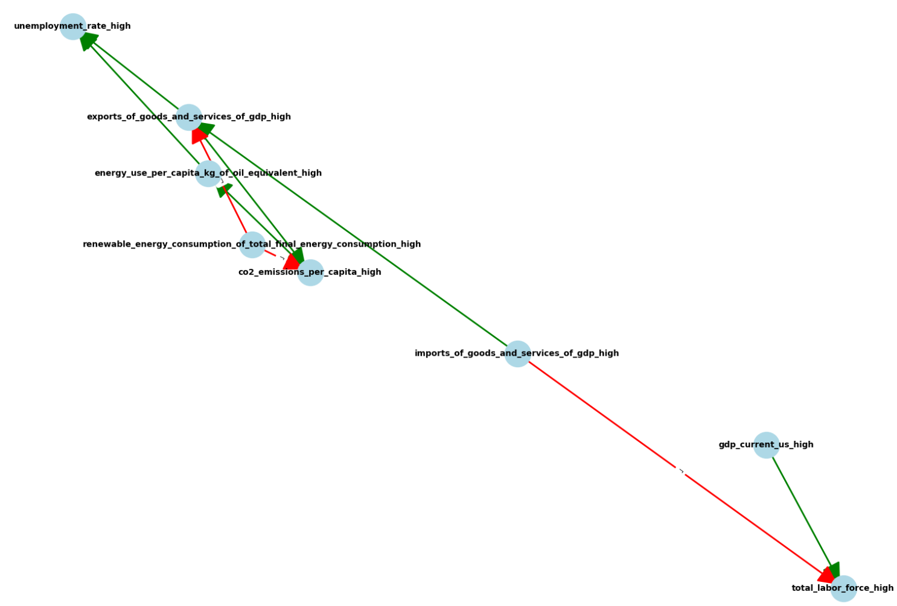

# Automatic Generation of Production-Side Structure in Computable General Equilibrium Models Based on Observational Data and Background Knowledge (Reduced-Form Growth Regression Model)

**観測データと背景知識に基づく応用一般均衡モデル生産サイド（縮約版成長回帰モデル）構造の自動生成**

## Overview

本プロジェクトは、**観測データと背景知識に基づいて応用一般均衡モデル（CGE）の生産関数を構造的に自動生成**するPythonベースの実験的ワークフローです。

- ブーリアン因果ルールの抽出（データ駆動＋LLM補助）
- 矛盾ルールの除去（ASP: Answer Set Programming）
- 回帰による係数推定（sklearn）
- Cobb-Douglas型生産関数の推定
- GAMSpyによる最適化モデル構築・解法

## Application Context

- 世界銀行WDIからのデータ取得（GDP, CO₂, 再エネ, 労働力, 資本形成 など）
- モデル構造の変化を通じて因果シナリオの比較分析が可能

## 🔧 Requirements

- Python >= 3.8
- `gamspy`, `scikit-learn`, `pandas`, `numpy`, `wbdata`, `networkx`, `clingo`, `pyyaml`
- GAMS (for solving the model)

```bash
pip install -r requirements.txt
```


